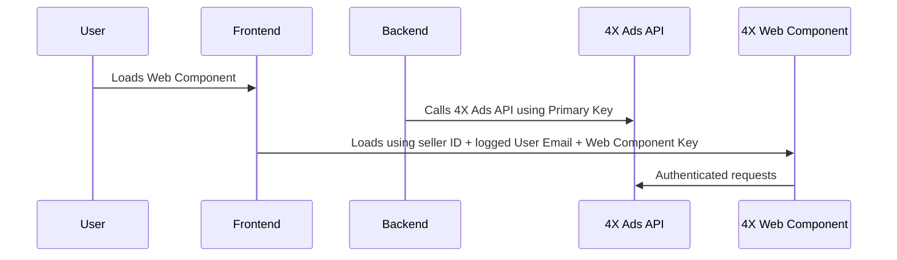

# 4X Integration Samples


Welcome to the **4X Platform Integration Samples** repository.

This repository provides end-to-end integration samples for embedding the 4X Web Component and interacting with the 4X Ads API, enabling you to quickly deliver advertising functionality within your platform

## 👤 Intended Audience

This repository is for developers who want to integrate 4X features into their platform. It is intended for:

- Frontend engineers embedding the 4X Web Component
- Backend developers calling the 4X Ads API
- Anyone testing or evaluating 4X integrations

---

## 📚 Table of Contents

- [Overview](#-overview)
- [How It Works](#-how-it-works)
- [Quick Start Guide](#-quick-start-guide)
  - [Accept Invitation to Developer Portal](#1-accept-invitation-to-developer-portal)
  - [Retrieve 4X Ads API Keys](#2-retrieve-4x-ads-api-keys)
  - [Retrieve Web Component Key](#3-retrieve-web-component-key)  
  - [Create Seller](#4-create-seller)
  - [Create User](#5-create-user)
  - [Manage Subscription](#6-manage-subscription)
  - [Embed the Web Component](#7-embed-and-configure-the-web-component)
  - [Sample UI Preview](#sample-ui-preview)
  - [Next Steps](#-next-steps)
- [Need Help?](#-need-help)

---

## 🔍 Overview

Whether you're evaluating the platform or preparing a production deployment, these samples are designed to accelerate your integration. This repository includes:

- Frontend samples (React) with live StackBlitz demos
- A Postman collection for direct REST API usage
- A sample UI preview and sequence diagram

---

## 🔄 How It Works



---

### 📬 Postman Collection

|                              |
| :-------------------------------------------------------------------------: |
| [Postman Collection](00-PostmanCollection/4XAdsAPI.postman_collection.json) |

---

## 📋 Quick Start Guide

### ⚙️ Prerequisites

Before you begin, ensure you have:

- An invitation to the 4X Developer Portal

### 1. Accept Invitation to Developer Portal

You’ll receive an email invitation from 4X to access the [4X Developer Portal](https://api.4xdigital.ai).
Click the link in the email to create your password and log in to your account.

---


---

### 2. Retrieve 4X Ads API Keys

After logging in, go to the Profile section:

- [🔗https://api.4xdigital.ai/profile](https://api.4xdigital.ai/profile)

There, you’ll find your:

- **Primary Key**
- **Secondary Key**

Use **either key** to authenticate your requests by setting this header:

```js
Ocp-Apim-Subscription-Key: <REPLACE_ME_PRIMARY_KEY_FROM_PROFILE_PAGE>
```

---


---

### 3. Retrieve Web Component Key

To embed the component in your app and securely communicate with the backend, you'll need your credentials:

- **Web Component Key**

Follow these steps to obtain it:

- **📘Generate the keys**

| Environment | Docs                                                                                                                          |
| ----------- | :---------------------------------------------------------------------------------------------------------------------------: |
| Production  | [View API Docs (prod)](https://api.4xdigital.ai/api-details#api=integration&operation=generateWebComponentConfiguration)      |
| Mock Server | [View API Docs (mock)](https://api.4xdigital.ai/api-details#api=integration-mock&operation=generateWebComponentConfiguration) |

- **📘Retrieve the keys**

| Environment | Docs                                                                                                            |
| ----------- | :-------------------------------------------------------------------------------------------------------------: |
| Production  | [View API Docs (prod)](https://api.4xdigital.ai/api-details#api=integration&operation=getWebComponentKeys)      |
| Mock Server | [View API Docs (mock)](https://api.4xdigital.ai/api-details#api=integration-mock&operation=getWebComponentKeys) |

Add the domains that are allowed to embed the Web Component

- **📘Add URL to Whitelist**

| Environment | Docs                                                                                                            |
| ----------- | :-------------------------------------------------------------------------------------------------------------: |
| Production  | [View API Docs (prod)](https://api.4xdigital.ai/api-details#api=integration&operation=createWhitelistItem)      |
| Mock Server | [View API Docs (mock)](https://api.4xdigital.ai/api-details#api=integration-mock&operation=createWhitelistItem) |

- **📘Remove URL from Whitelist**

| Environment | Docs                                                                                                            |
| ----------- | :-------------------------------------------------------------------------------------------------------------: |
| Production  | [View API Docs (prod)](https://api.4xdigital.ai/api-details#api=integration&operation=deleteWhitelistItem)      |
| Mock Server | [View API Docs (mock)](https://api.4xdigital.ai/api-details#api=integration-mock&operation=deleteWhitelistItem) |

- **📘Get Allowed Domains**

| Environment | Docs                                                                                                     |
| ----------- | :------------------------------------------------------------------------------------------------------: |
| Production  | [View API Docs (prod)](https://api.4xdigital.ai/api-details#api=integration&operation=getWhitelist)      |
| Mock Server | [View API Docs (mock)](https://api.4xdigital.ai/api-details#api=integration-mock&operation=getWhitelist) |

#### 💡 Security Notes (Important)

- **All API requests and embedded components must use HTTPS. Requests over HTTP will be rejected**

### 4. Create Seller

To create a seller on the 4X Platform, invoke the seller creation endpoint from your backend. You can create the seller when they enable the advertising add-on on your platform. This registers the seller and associates them with your platform

- **📘Create Seller**

| Environment | Docs                                                                                                                 |
| ----------- | :------------------------------------------------------------------------------------------------------------------: |
| Production  | [View API Docs (prod)](https://api.4xdigital.ai/api-details#api=integration&operation=createSellerWithChannels)      |
| Mock Server | [View API Docs (mock)](https://api.4xdigital.ai/api-details#api=integration-mock&operation=createSellerWithChannels) |

- **📘Update Seller**

| Environment | Docs                                                                                                                 |
| ----------- | :------------------------------------------------------------------------------------------------------------------: |
| Production  | [View API Docs (prod)](https://api.4xdigital.ai/api-details#api=integration&operation=updateSellerWithChannels)      |
| Mock Server | [View API Docs (mock)](https://api.4xdigital.ai/api-details#api=integration-mock&operation=updateSellerWithChannels) |

- **📘Get Seller Info**

| Environment | Docs                                                                                                              |
| ----------- | :---------------------------------------------------------------------------------------------------------------: |
| Production  | [View API Docs (prod)](https://api.4xdigital.ai/api-details#api=integration&operation=getSellerWithChannels)      |
| Mock Server | [View API Docs (mock)](https://api.4xdigital.ai/api-details#api=integration-mock&operation=getSellerWithChannels) |

💡Store the **Seller ID** returned and map it to your internal seller record

### 5. Create User

To create users under a seller, use:

- **📘Create User**

| Environment | Docs                                                                                                   |
| ----------- | :----------------------------------------------------------------------------------------------------: |
| Production  | [View API Docs (prod)](https://api.4xdigital.ai/api-details#api=integration&operation=createUser)      |
| Mock Server | [View API Docs (mock)](https://api.4xdigital.ai/api-details#api=integration-mock&operation=createUser) |

### 6. Manage Subscription

You can control whether a seller has an active subscription using these endpoints:

- **📘Start Subscription**

| Environment | Docs                                                                                                          |
| ----------- | :-----------------------------------------------------------------------------------------------------------: |
| Production  | [View API Docs (prod)](https://api.4xdigital.ai/api-details#api=integration&operation=startSubscription)      |
| Mock Server | [View API Docs (mock)](https://api.4xdigital.ai/api-details#api=integration-mock&operation=startSubscription) |

- **📘Pause Subscription**

| Environment | Docs                                                                                                          |
| ----------- | :-----------------------------------------------------------------------------------------------------------: |
| Production  | [View API Docs (prod)](https://api.4xdigital.ai/api-details#api=integration&operation=pauseSubscription)      |
| Mock Server | [View API Docs (mock)](https://api.4xdigital.ai/api-details#api=integration-mock&operation=pauseSubscription) |

### 7. Embed and Configure the Web Component

Embed the Web Component in your frontend and provide the required attributes

#### 🔗 Web Component Assets

To load the 4X Web Component, include the following tags in your HTML:

```html
<link rel="stylesheet" href="https://cdn.4xdigital.ai/index-0.2.0.css">
<script src="https://cdn.4xdigital.ai/index-0.2.0.js" defer></script>
```

#### 📏 Minimum Width Requirement (Important)

To render properly, the 4X Web Component requires a container with at least **520px width**. Be sure to apply this minimum to any container wrapping the component:

```html
<div style="min-width: 520px;">
    <wc-4xd
        web-component-key="<REPLACE_ME_WITH_WEB_COMPONENT_KEY_FROM_STEP_3>"
        seller-id="<REPLACE_ME_WITH_SELLER_ID_FROM_STEP_4>"
        email="<REPLACE_ME_WITH_USER_EMAIL_FROM_STEP_5>"
        route="/home"
        hidden-sidebar="false"
        primary-color="#0040ff"
        secondary-color="#00ffcc"
        lang="en-US">
    </wc-4xd>
</div>
```

✅ Use the **Web Component Key**, the **Seller ID** and **Email** from previous steps

#### Optional Properties

| Name            | Description                                                                                                                 | Type              |
| --------------- | --------------------------------------------------------------------------------------------------------------------------- | ----------------- |
| route           | Controls which route of the app is rendered. Available routes:<br>- /home<br>- /campaigns<br>- /dashboard<br>- /my-business | string            |
| hidden-sidebar  | Shows or hides the sidebar                                                                                                  | boolean           |
| primary-color   | Sets the primary theme color                                                                                                | string            |
| secondary-color | Sets the secondary theme color                                                                                              | string            |
| lang            | Sets the language (IETF tag, e.g. en-US, pt-BR)                                                                             | IETF language tag |

#### Sample UI Preview

Here’s what the 4X Web Component looks like inside your platform:


Examples

|                                                |
| :---------------------------------------------------------------------------------------: |
| [StackBlitz](https://stackblitz.com/edit/four-x-webcomponent-react-sample?file=README.md) |
| [React](07-EmbedWebComponent/react/README.md)                                             |

---

### 📌 Next Steps

- ✅ You’ve:
  - Connected to the 4X Developer Portal
  - Retrieved your 4X Ads API and Web Component keys
  - Registered your seller and users
  - Managed subscription
  - Embedded the Web Component

- 🚀 Next:
  - Configure the add-on in your marketplace
  - Start sending data to 4X
  - Explore more features in our [API Docs](https://api.4xdigital.ai/api-details#api=integration-mock)

---

## 🆘 Need Help?

Contact our team at [support@4xdigital.ai](mailto:support@4xdigital.ai) — we’re here to help!
