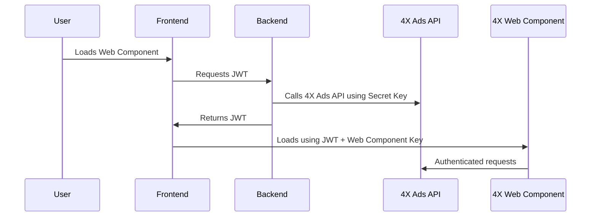
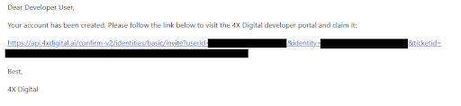
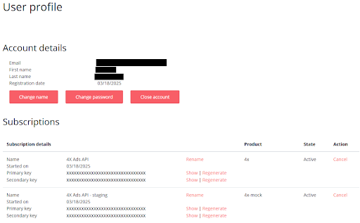

# 4X Integration Samples


Welcome to the **4X Platform Integration Samples** repository.

This repo contains sample code to help you integrate the 4X Web Component and Ads API into your frontend and backend.

## 👤 Intended Audience

This repository is for developers who want to integrate 4X features into their platform. It is useful for:

- Frontend engineers embedding the 4X Web Component
- Backend developers generating JWT tokens and calling the 4X Ads API
- Anyone testing or evaluating 4X integrations

---

## 📚 Table of Contents

- [Overview](#-overview)
- [How It Works](#-how-it-works)
- [4X Ads API Client Libraries](#-4x-ads-api-client-libraries)
- [Quick Start Guide](#-quick-start-guide)
  - [Accept Invitation to Developer Portal](#1-accept-invitation-to-developer-portal)
  - [Retrieve 4X Ads API Keys](#2-retrieve-4x-ads-api-keys)
  - [Retrieve Web Component Key](#3-retrieve-web-component-key)  
  - [Create Seller](#4-create-seller)
  - [Start or Pause a Subscription](#5-start-or-pause-a-subscription)
  - [Create User](#6-create-user)
  - [Generate a Secure Token (JWT)](#7-generate-a-secure-token-jwt)
  - [Embed the Web Component](#8-embed-and-configure-the-web-component)
  - [Sample UI Preview](#sample-ui-preview)
  - [Next Steps](#-next-steps)
- [Need Help?](#-need-help)

---

## 🔍 Overview

Whether you're evaluating the platform or preparing a production deployment, these samples are designed to accelerate your integration. This repository includes:

- Frontend samples (Angular, React, Vue, and TypeScript) with live StackBlitz demos
- Backend samples (C#, Node.js, Python) to generate JWTs and call the 4X Ads API using the official client libraries
- A Postman collection for direct REST API usage
- A sample UI preview and sequence diagram

---

## 🔄 How It Works



---

## 📦 4X Ads API Client Libraries

To simplify the integration with our 4X Ads API, we provide official client libraries published to GitHub Packages. These packages handle authentication, headers, and endpoint logic so you can focus on your business logic.

| Language             | Package Name                   | Install Command                                                                                           |
|----------------------|--------------------------------|-----------------------------------------------------------------------------------------------------------|
| C# (.NET)            | `FourX.AdsApi.Client`          | `dotnet add package FourX.AdsApi.Client --source https://nuget.pkg.github.com/4xcompany/index.json`       |
| Node.js (TypeScript) | `@4xcompany/four-x-ads-client` | `npm install @4xcompany/four-x-ads-client --registry=https://npm.pkg.github.com`                          |
| Python               | `four-x-ads-client`            | `pip install four-x-ads-client --extra-index-url https://__token__:<TOKEN>@pypi.pkg.github.com/4xcompany` |

### 📬 Postman Collection

Don’t see your backend language here? You can still use our REST API directly.

|                              |
| :-------------------------------------------------------------------------: |
| [Postman Collection](00-PostmanCollection/4XAdsAPI.postman_collection.json) |

---

## 📋 Quick Start Guide

### 1. Accept Invitation to Developer Portal

You’ll receive an email invitation from 4X to access the [4X Developer Portal](https://api.4xdigital.ai).
Click the link in the email to create your password and log in to your account.

---



---

### 2. Retrieve 4X Ads API Keys

After logging in, go to the Profile section:

- [🔗https://api.4xdigital.ai/profile](https://api.4xdigital.ai/profile)

There, you’ll find your:

- **Primary Key**
- **Secondary Key**

Use **either key** to authenticate your requests by setting this header:

``` js
Ocp-Apim-Subscription-Key: <YOUR_API_KEY>
```

---



---

### 3. Retrieve Web Component Key

To embed the component in your app and securely communicate with the backend, you'll need two credentials:

- **Web Component Key**
- **Secret Key**

Follow these steps to obtain them:

1. **Generate the keys: [Generate Web Component Configuration](https://api.4xdigital.ai/api-details#api=integration-mock&operation=generateWebComponentConfiguration)**
2. **Retrieve the keys: [Get Web Component Keys](https://api.4xdigital.ai/api-details#api=integration-mock&operation=getWebComponentKeys)**

#### 💡 Security Notes (Important)

- **Store the Secret Key securely and use it only on your backend. Never expose it in frontend code**
- **All API requests and embedded components must use HTTPS. Requests over HTTP will be rejected**

Examples

|       |       |       |
| :--------------------------------------------: | :-------------------------------------------------: | :------------------------------------------------: |
| [C#](RetrieveWebComponentKey/csharp/README.md) | [Node.js](RetrieveWebComponentKey/nodejs/README.md) | [Python](RetrieveWebComponentKey/python/README.md) |

### 4. Create Seller

To create a seller on the 4X Platform, call the seller creation API from your backend. You can determine when to create the seller, for instance when the seller enables the advertising add-on on your platform. This registers the seller and links them to your platform

- 📘[Create Seller API](https://api.4xdigital.ai/api-details#api=integration-mock&operation=createSellerWithChannels)
- 📘[Get Seller Info API](https://api.4xdigital.ai/api-details#api=integration-mock&operation=getSellerWithChannels)

💡The **Seller ID** returned should be stored and mapped to your internal seller record

Examples

|  |  |  |
| :---------------------------------------: | :--------------------------------------------: | :-------------------------------------------: |
| [C#](CreateSeller/csharp/README.md)       | [Node.js](CreateSeller/nodejs/README.md)       | [Python](CreateSeller/python/README.md)       |

### 5. Start or Pause a Subscription

You can control whether a seller has an active subscription using these endpoints:

- 📘[Start Subscriptions API](https://api.4xdigital.ai/api-details#api=integration-mock&operation=startSubscription)
- 📘[Pause Subscriptions API](https://api.4xdigital.ai/api-details#api=integration-mock&operation=pauseSubscription)

Examples

|      |      |      |
| :-------------------------------------------: | :------------------------------------------------: | :-----------------------------------------------: |
| [C#](StartPauseSubscription/csharp/README.md) | [Node.js](StartPauseSubscription/nodejs/README.md) | [Python](StartPauseSubscription/python/README.md) |

### 6. Create User

To create users under a seller, use:

- 📘[Create User API](https://api.4xdigital.ai/api-details#api=integration-mock&operation=createUser)

Examples

|  |  |  |
| :---------------------------------------: | :--------------------------------------------: | :-------------------------------------------: |
| [C#](CreateUser/csharp/README.md)         | [Node.js](CreateUser/nodejs/README.md)         | [Python](CreateUser/python/README.md)         |

### 7. Generate a Secure Token (JWT)

Merchants using the embedded 4X experience don’t need to sign in again. Instead, your backend generates a signed JWT that authenticates the user. This token must be generated **on your backend**, using the Secret Key received earlier, and signed using HS256. You can find a sample implementation in the examples section.
This token is required when rendering the Web Component

#### ✅ JWT Payload

- **Seller ID:** After you create an account for the merchant who signed-up for ads with 4X, you’ll receive a Seller ID, which identifies the merchant in 4X and must be included when generating the Web Component token
- **Email:** This is the email of the user associated with the merchant account in 4X. Any users associated with the merchant who will have access to ads need to be added as a user in 4X. This is the email of the currently logged-in user on your platform
- **exp:** Token expiration time in [Unix timestamp format](https://www.epochconverter.com/) (seconds since epoch, UTC). This defines how long the token will be valid. We recommend setting it to 5 to 15 minutes from the token creation time

``` js
{
    "sellerId": "abcd1234-ab12-cd34-ef56-abcdef123456",
    "email": "developer@example.com",
    "exp": 1714326600
}
```

**JWT Example Output:**

``` js
eyJhbGciOiJIUzI1NiIsInR5cCI6IkpXVCJ9...
```

🧪 **Never** expose your **Secret Key or token signing logic** in the **frontend**. Always generate tokens server-side

Examples

|  |  |  |
| :---------------------------------------: | :--------------------------------------------: | :-------------------------------------------: |
| [C#](GenerateTokenJwt/csharp/README.md)   | [Node.js](GenerateTokenJwt/nodejs/README.md)   | [Python](GenerateTokenJwt/python/README.md)   |

### 8. Embed and Configure the Web Component

Embed the Web Component in your frontend and provide the required attributes

#### 📏 Minimum Width Requirement (Important)

To render properly, the 4X Web Component requires a container with at least **520px width**. Be sure to apply this minimum to any container wrapping the component:

``` html
<div style="min-width: 520px;">
    <wc-4xd
        web-component-key="<WEB-COMPONENT-KEY>"
        token="<JWT-TOKEN>"
        route="/"
        hidden-sidebar="false"
        primary-color="#0040ff"
        secondary-color="#00ffcc"
        lang="en-US">
    </wc-4xd>
</div>
```

✅ Use the **Web Component Key** and the generated **JWT Token** from previous steps

Generate the JWT dynamically based on the user currently logged in to your platform

#### Optional Properties

| Name            | Description                                                                                                                 | Type              |
| --------------- | --------------------------------------------------------------------------------------------------------------------------- | ----------------- |
| route           | Controls which route of the app is rendered. Available routes:<br>- /home<br>- /campaigns<br>- /dashboard<br>- /my-business | string            |
| hidden-sidebar  | Shows or hides the sidebar                                                                                                  | boolean           |
| primary-color   | Sets the primary theme color                                                                                                | string            |
| secondary-color | Sets the secondary theme color                                                                                              | string            |
| lang            | Sets the language (IETF tag, e.g. en-US, pt-BR)                                                                             | IETF language tag |

#### Sample UI Preview

Here’s what the 4X Web Component looks like inside your platform:


Examples

|  |  |  |     |
| :-----------------------------------------------: | :-----------------------------------------: | :---------------------------------------------------: | :-------------------------------: |
| [Angular](EmbedWebComponent/angular/README.md)    | [React](EmbedWebComponent/react/README.md)  | [TypeScript](EmbedWebComponent/typescript/README.md)  | [Vue](EmbedWebComponent/vue/README.md) |
| [StackBlitz](https://stackblitz.com/github/4XDigital/four-x-integration-samples/tree/main/EmbedWebComponent/angular) | [StackBlitz](https://stackblitz.com/github/4XDigital/four-x-integration-samples/tree/main/EmbedWebComponent/react) | [StackBlitz](https://stackblitz.com/github/4XDigital/four-x-integration-samples/tree/main/EmbedWebComponent/typescript) | [StackBlitz](https://stackblitz.com/github/4XDigital/four-x-integration-samples/tree/main/EmbedWebComponent/vue) |

---

### 📌 Next Steps

- ✅ You’ve:
  - Connected to the 4X Developer Portal
  - Retrieved your API and Web Component keys
  - Generated a secure JWT
  - Registered your seller and users
  - Embedded the Web Component

- 🚀 Next:
  - Configure the add-on in your marketplace
  - Start sending data to 4X
  - Explore more features in our [API Docs](https://api.4xdigital.ai/api-details#api=integration-mock)

---

## 🆘 Need Help?

Contact our team at [support@4xdigital.ai](mailto:support@4xdigital.ai) — we’re here to help!
